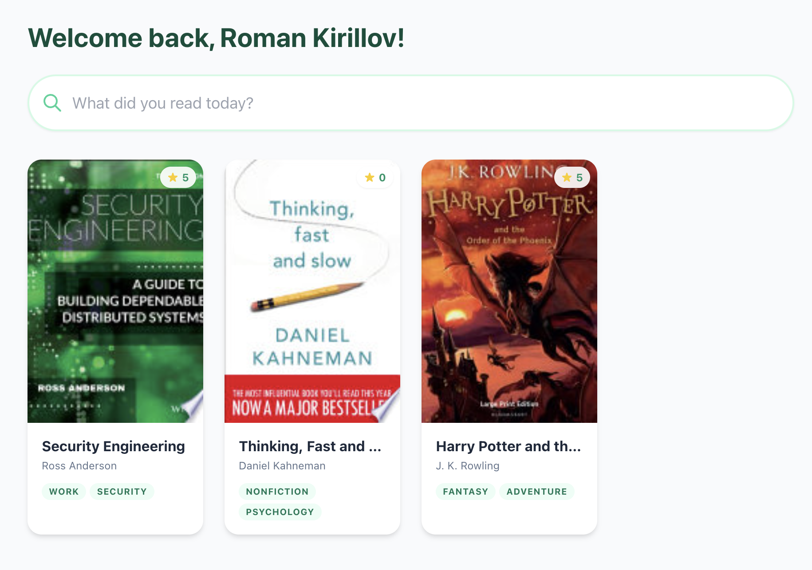

# BookScout 📚

My kids love reading (obviously taking after their dad!), and they are asking for new books all the time. With **industrial amounts of books** passing through their hands, it's just not easy to keep track of who read what. 

They wouldn't use Goodreads — it's too bloated — and Google Spreadsheets are probably too basic. So, being the [tinkerer](https://blog.kirillov.cc) I am, I created a very special app for them (and them only!) which allows me to see very easily who read what.



## How to Run 🛠️

To get this up and running, you'll need to configure a few things for authentication. Create a `.env` file in the root directory with the following keys:

```bash
# OAuth2 Sign-in with Google
GOOGLE_CLIENT_ID=your_google_client_id
GOOGLE_CLIENT_SECRET=your_google_client_secret

# Session Security
SESSION_SECRET=some_long_random_string

# Admin Access
ADMIN_USER=username@gmail.com
```

Then, just run:

```bash
node index.js
# or
docker-compose up
```

Happy reading! 📖
